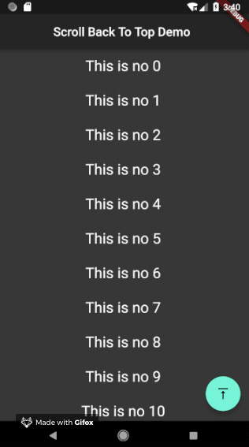
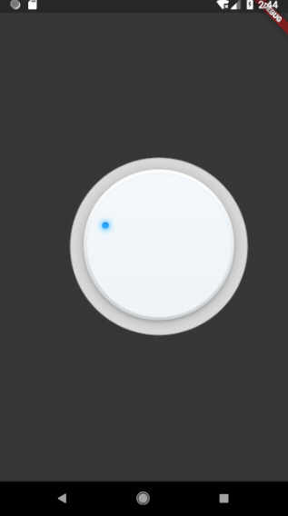
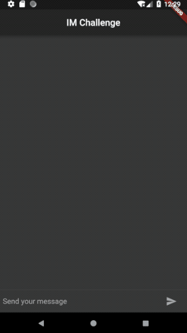
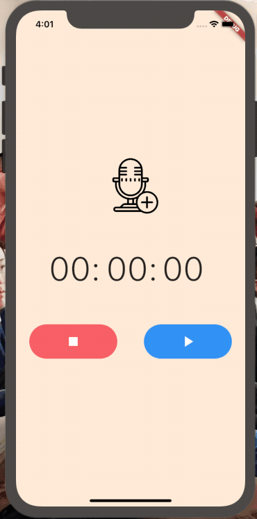
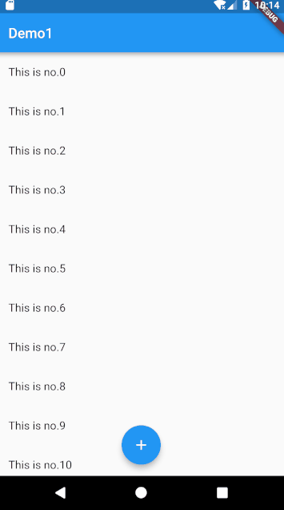

# flutter_ui_challenge
## 简介
flutter UI挑战【持续更新中】
## 样例
### [模拟微博/twitter点击回到顶部效果](https://github.com/OpenFlutter/Flutter-Notebook/blob/master/mecury_project/example/animation_challenge/lib/screens/scroll_back_to_top_demo.dart)

### [旋转按钮，且能够获取旋转角度0-360](https://github.com/OpenFlutter/Flutter-Notebook/blob/master/mecury_project/example/animation_challenge/lib/widgets/rotating_bar.dart)

### [IM聊天界面](https://github.com/OpenFlutter/Flutter-Notebook/blob/master/mecury_project/example/animation_challenge/lib/screens/im_demo.dart)

### [沉浸式底部导航](https://github.com/OpenFlutter/Flutter-Notebook/blob/master/mecury_project/example/animation_challenge/lib/screens/hide_bottom_bar.dart)

### [录音机](https://github.com/OpenFlutter/Flutter-Notebook/blob/master/mecury_project/example/animation_challenge/lib/screens/audio_screen.dart)

### [hero 挑战](https://github.com/OpenFlutter/Flutter-Notebook/blob/master/mecury_project/example/animation_challenge/lib/screens/hero_demo.dart)

## Getting Started

For help getting started with Flutter, view our online
[documentation](https://flutter.io/).
