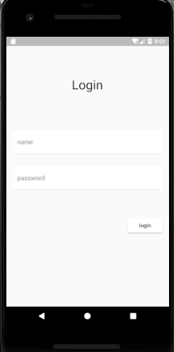
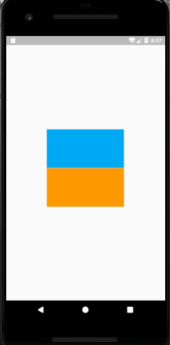
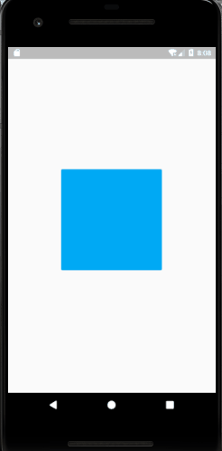
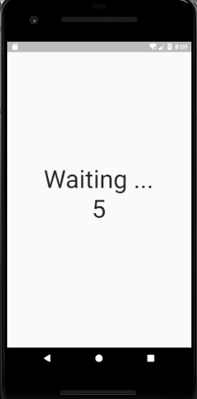
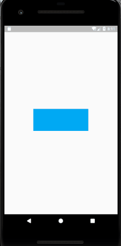

# flutter动画Demo，其中包含以下类型动画：

- 基础动画：basic_animation_demo.dart
- 延迟动画：delayed_animation_demo.dart
- 父子动画：parent_animation_demo.dart，another_parent_animation_demo.dart
- 转换动画： transforming_animation_demo.dart
- 价值转换动画：value_change_animation_demo.dart
- 使用动画单击隐藏小部件，双击显示小部件：hidden_widget_animation_demo

# 使用方式
main函数中，import的是当前动画样例，其他被注释起来了，只需更改注释即可。

A new Flutter application with beautiful animation

## Getting Started

For help getting started with Flutter, view our online
[documentation](https://flutter.io/).
