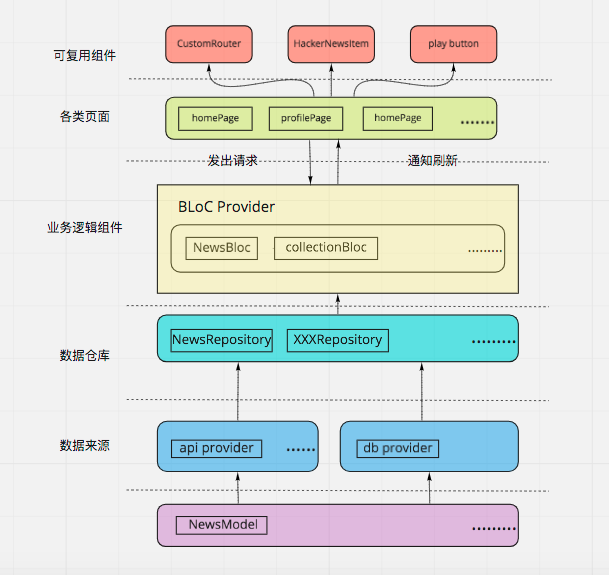

# bloc_demo
## 简介
使用BLoC管理状态的demo，这里分为三个版本（single_global_instance / scoped / rxdart）,请自行切换查看
## 样例

## 一个更加完整的应用
### 简介
来自于Stephen Grider的hacker news app，使用了bloc作为状态管理。十分具有参考价值且足够简单。

请安装在真机上并打开科学上网工具才能正确访问hacker news api

[hacker news app](https://github.com/Vadaski/hacker_news_app)
### 项目结构（仅供参考）

