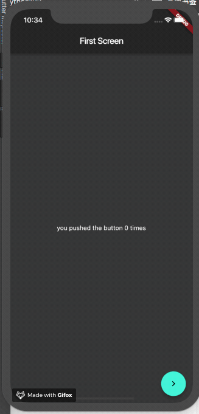

# event_bus_demo

使用EventBus在不同页面中同步状态的demo。这里使用rxdart扩展了bus的功能，已经提交了一个pr，已经合并
具体参考这个[issue](https://github.com/marcojakob/dart-event-bus/pull/21)。

使用方式可以查看这篇博客：https://code.makery.ch/library/dart-event-bus/

## 添加eventbus
仓库地址：https://pub.dartlang.org/packages/event_bus

## 样例

