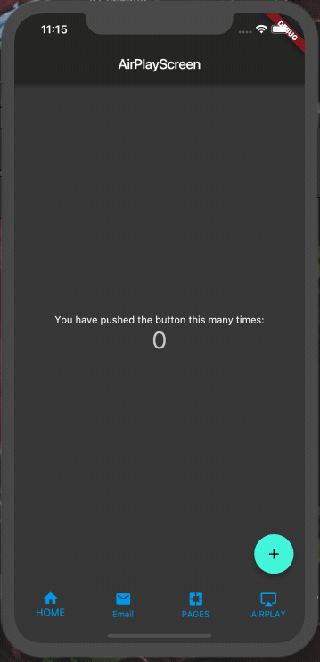

# flutter_bottomnavigationbar
## 简介
使用bottomnavigationbar底部导航的demo，新增保持状态的demo，请查阅注释。
## 样例

## Getting Started

For help getting started with Flutter, view our online
[documentation](https://flutter.io/).

这是一个最简单的flutter底部导航demo
Youtube教程:https://www.youtube.com/watch?v=iYDaC2ESCkg&t=976s
bilibili教程:https://www.bilibili.com/video/av28014369
掘金：https://juejin.im/post/5b5d8d1c6fb9a04fd6596188
