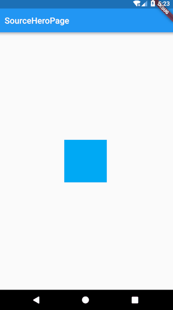

# hero_demo
## 简介
hero动画是flutter自带的组件之一，它允许您在转换页面的时候，组件能够直接从源页面“飞”到目标页面。

使用方法及要点已经在注释中给出。
## 样例

## Getting Started

For help getting started with Flutter, view our online
[documentation](https://flutter.io/).
