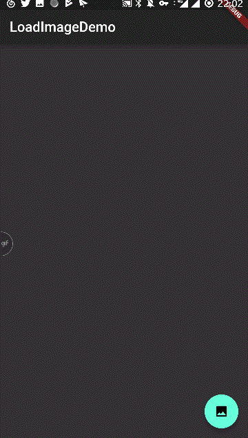

# load_multi_image
## 简介
在flutter中从本地获取多张图片的demo，若出现minsdk版本导致编译失败，请修改build.gradle中minsdk版本为19
## 依赖
[multi_image_picker 2.2.10](https://pub.dartlang.org/packages/multi_image_picker#-readme-tab-)
## 样例

## Getting Started

For help getting started with Flutter, view our online
[documentation](https://flutter.io/).
