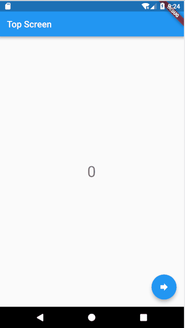

# redux_demo

## 简介
使用redux，在flutter中共享状态的demo，具体用法请看[仓库。](https://pub.dartlang.org/packages/flutter_redux)

## 样例

## Getting Started

For help getting started with Flutter, view our online
[documentation](https://flutter.io/).
