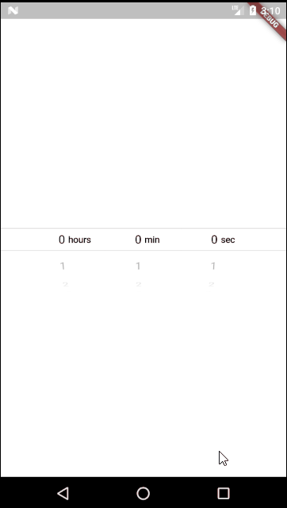
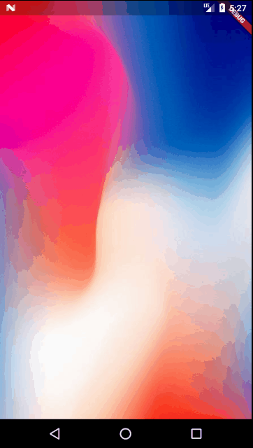
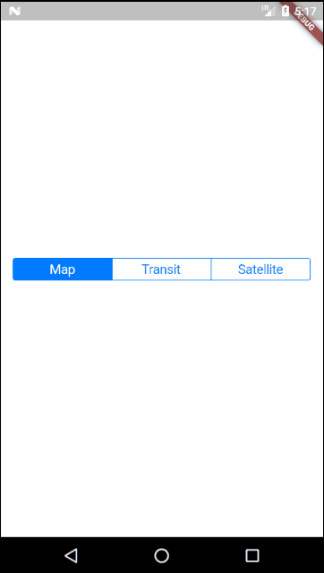
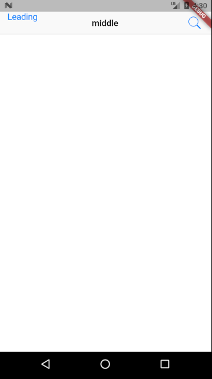
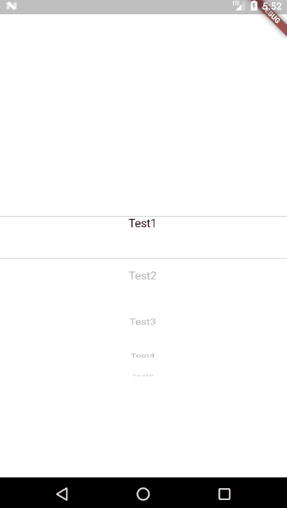
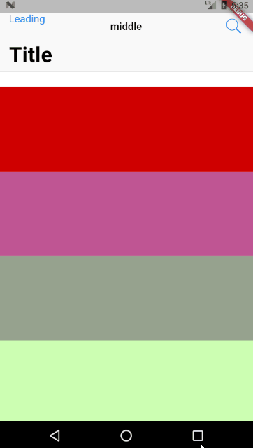
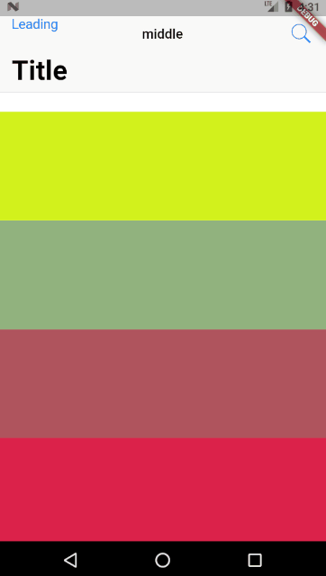
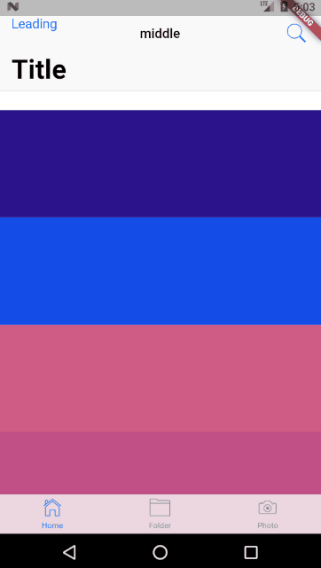

# release_preview2
## 简介
GDD2018新发布的Flutter preview2 widget体验
## 感想
在体验了这么多cupertino风格的widgets以后，着实能感受到谷歌很大的一番诚意。不论在流畅度或者是易用性上，都是精心设计过的。
就算我之前几乎完全没有使用过这些组件，但是也能在5分钟以内快速上手，这足以说明flutter的学习成本是可控的。
从体验上来讲，我认为流畅度以及风格已经与ios原生极为接近，如果不是下面有安卓底部的虚拟键，或许真的就和iphone体验一样了。

另外有一个个人的想法：既然flutter能够提供丰富的cupertino风格组件库，而平时对用户来说ios的体验反馈又一直不错，以后flutter应用会不会有向ios风格靠近的趋势呢。毕竟技术成本已经被填上了，剩下的可能会交给用户去做选择吧。

最后，感谢彦博为这个demo提出非常棒的建议，segment control与action sheet已经改为较为合理的使用方式。
## 样例

## Getting Started

For help getting started with Flutter, view our online
[documentation](https://flutter.io/).
