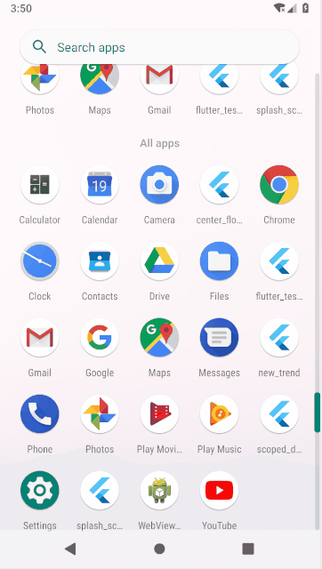

# splash_screen_demo

## 介绍
应用启动前展示闪屏页的demo，这是一种通过animation实现的方式

## 原理
在应用开始时进入闪屏页，通过动画控制透明度不断减弱。
通过animation.addStatusListener来检测动画是否播放完毕，完毕后push主页面并将该页面从路由中销毁。

## 样例

## Getting Started

For help getting started with Flutter, view our online
[documentation](https://flutter.io/).
