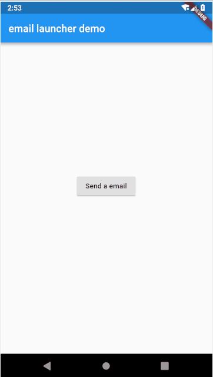
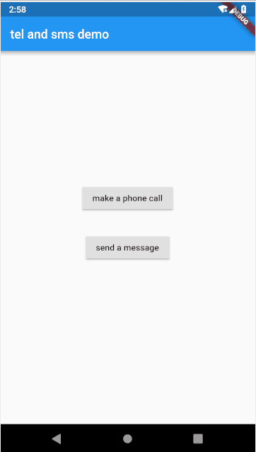

# url_launcher_demo

## 一组使用url_launcher实现以下功能的demo
- 能够调用webview打开网页
- 能够调用浏览器打开网页
- 能够唤醒键盘拨号，并直接输入好电话号码
- 能够唤醒短信发送界面，同样已经输好联系人
- 能够唤醒gmail/邮件发送软件发送邮件

  其中要点已在注释中给出
  

## Getting Started

For help getting started with Flutter, view our online
[documentation](https://flutter.io/).
